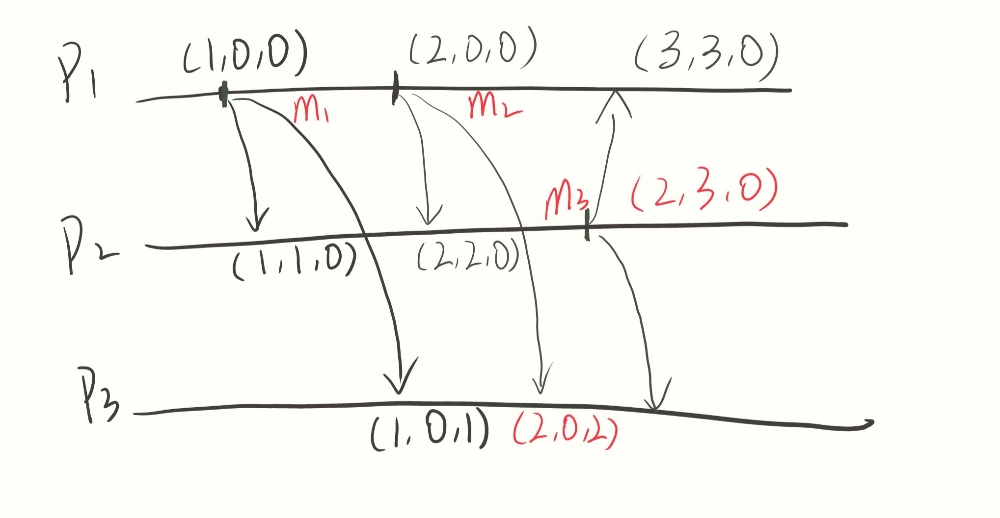

# 
中山大学计算机学院

# 
分布式系统

## 
第三次作业

## 
（2023学年秋季学期）

<!-- 让表格居中显示的风格 -->

课程名称：Distributed System

| 教学班级 | 2021级计算机科学 与技术2班 |专业（方向） | 计算机科学与技术 |
|----|----|----|----|
| **学号** | **21307236**| **姓名** | **唐成文** |

### (1) 从分布式系统的角度，如果事件a和b具有happensbefore的关系，a→b，我们说b对a有因果依赖。那么，从现实世界的角度，事件b的发生一定是与a有关系吗？为什么？
* 答：
  * happens-before关系用于描述事件之间的时序关系，但它并不一定表示实际的因果关系，也即事件a → b只是表示事件a在时间上发生在事件b之前，而并不意味着a的发生直接导致了b的发生。
  * 此外，a→b也代表了a操作对于b操作是可见的，但事件b的发生不一定与a有关系，例如假设a表示对某个共享数据的写操作，而b表示对同一数据的读操作，那么a → b的关系表示在时间上a的写操作先于b的读操作，因此b将能够看到a所做的修改，但却并不意味着b执行读操作和a执行写操作有关系。
  
### (2) 在强制因果有序多播的例子中，如果发送、接收消息各作为一个事件增加时钟计数，如何修改算法中消息交付操作才能满足要求？
* 答：修改后的算法过程如下：
  在原算法中，只有发送消息时才会增加时钟计数，现在要求发送接收消息都增加时钟技术，则需要改变原算法中阻塞接收条件\(ts(m)[i]=VC_j[i]+1\)条件，改为\(ts(m)[i]> C_j[i] \)，理由是因为接收消息也会增加时钟计数，而增加的时钟计数并不会及时告知其他进程，因此只需要能保证发送端的时钟计数比接收端大即可，而具体大多少无法界定。
  * 以下图为例进行解析：
  * 
  * 如图，因为P2在发送消息\(m3\)以前，已经接收了2次消息（\(m1和m2）\)导致\(ts(m_3)[1]=3\)，而在\(P_3\)中尚未更新\(VC_2[1]\)的值，导致并不满足\(ts(m_3)[1]=VC_2[1]+1\)，而只是满足\(ts(m_3)[1]>VC_2[1]\)。但实际此时\(P_3\)应该需要接收\(m_3\)。

### (3) 基于环的选举算法中，如果两个Election消息同时在循环时，可以杀掉其中一个。设计一个机制实现这个功能。
* 答：基于环的选举算法解决冲突机制步骤如下：
  * 当任意一个进程收到选举消息时，首先查看自己是否是参与者：
    * 如果是参与者，则说明该进程先前已转发过选举消息，当前选举消息为第二个选举消息，则该进程就会去比较自己的标识符和该选举消息的最大标识符。如果进程的标识符更大，则说明当前选举消息最大标识符不比先前已转发的第一个选举消息的最大标识符大，因此可以直接丢弃该选举消息，即杀死当前选举消息；如果进程的标识符更小，则照常转发该选举消息给下一个进程。
    * 如果不是参与者，则同样比较自己的标识符和当前选举消息的最大标识符，如果进程的标识符更大，则更新选举消息的最大标识符为自身标识符并正常转发该消息给下一个进程。否则直接转发该消息给下一个进程。
  * 最后，如果一个进程收到一个选举消息发现自己的标识符等于选举消息中的最大标识符并且自己已经被标记为参与者，则说明该选举消息已经轮完一圈并且这一圈中并无比自己大的标识符，因此该进程直接把自己标注为协调者并转发协调者消息。