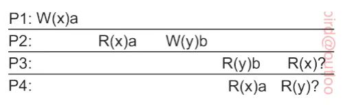

# 
中山大学计算机学院

# 
分布式系统

## 
第四次作业

## 
（2023学年秋季学期）

<!-- 让表格居中显示的风格 -->

课程名称：Distributed System

| 教学班级 | 2021级计算机科学 与技术2班 |专业（方向） | 计算机科学与技术 |
|----|----|----|----|
| **学号** | **21307236**| **姓名** | **唐成文** |

### (1) 请分析讨论，与sequential consistency相比，eventual consistency的优势和价值，并通过例子进行说明。
答：eventual consistency相比sequential consistency的优势在于：
* 更好的稳定性：最终一致性允许系统在某一时刻的状态不同步，但能保证最终会达到一致。这能允许系统在分布式环境中保持更好的可用性，因为即使某些节点之间的通信发生延迟或失败，系统也依然可以继续提供服务，而不会因为一时的不一致而停滞。例如在在线编辑文档的过程中文档内容可能短时间内在不同的客户端不一致的情况，但所有客户端依然可以继续编辑自己的内容，而在一定周期时间以后所有人看到的文档内容又都会一致了。而在这期间所有客户端都能正常使用在线编辑而不受抑制。
* 拥有更高的性能：由于最终一致性并不要求实时同步，系统就可以更快速地响应用户请求，而不必等待所有节点达成一致。例如A在互联网中发布了一个话题后B可以快速收到并参与讨论，而不用等待该话题到达所有节点。
* 能够容忍分区故障：最终一致性允许系统在分区故障的情况下继续运行。即使某些节点无法通信，数据暂时与其他节点不一致，系统也仍确保最终能够达到一致状态。例如在一个分布式文件系统中，各个节点存储不同部分的文件。在某个节点不可用的情况下，其他节点仍然可以提供文件访问服务，并在节点重新连接时最终同步数据。
### (2) 下面Causal consistency的操作例子，最后的两个读操作应该返回什么结果？

答：
* 由于因果一致性是指在一个分布式系统中，如果事件A在事件B之前发生，那么在系统的所有节点上，事件A的影响应该在事件B之前可见。
* 因此由于在P3中存在R(y)b,即读出y的数据为b，因此P3的开始应在P2的W(y)b之后，因此W(y)b之前的影响应该在P3中可见，而又由于W(y)b之前的R(x)a读出x数据为a，且之后没有对x进行任何写操作，所以在P3中读出x值也应该也应该为a。
* 而P4进程中我们可以看到存在R(x)a，只能说明P4进程的开始应在P1进程W(x)a之后，因此P4进程对y进行读操作可能读出y的原始值（未知），也可能读出y被执行W(y)b以后的值b。
### (3) 给出一个实现数据副本的因果一致性的方法思路。
* 使用互斥锁：
  * 在共享数据项上引入互斥锁，进程在对共享数据项进行更新前，需要先获取相应数据项的互斥锁，其他进程的更新请求将被阻塞，直到锁被释放，这样能确保在任何时刻只有一个进程可以对数据项进行更新。
*  非独占性访问处理：
   * 如果一个进程要以非互斥模式进入临界区，它必须确保前一个独占性访问已经完成，包括对锁关联数据的更新等。且需要确保获取了被保护共享数据的最新副本。
* 引入版本号：
  - 每个共享数据项维护一个版本号，用于标识数据项的更新历史。在读取和写入数据时，需要获取数据项的版本号。在每次对共享数据项进行更新时，要检查版本号，并在更新后增加相应的版本号。
* 引入最终一致性：
  - 定期进行数据同步，确保所有节点最终收敛到相同的数据状态。可以通过定时任务、事件触发等机制来触发数据同步。
  - 当有数据冲突时，需要一种解决策略，例如当两个节点分别对相同的数据项进行更新时，比较它们的版本号。选择具有较高版本号的更新作为最终更新，确保更新是按照因果关系的顺序进行的。
